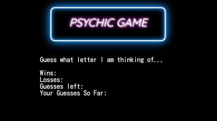

# Psychic-Game

In this activity, I created a Psychic game where the user has to guess the correct letter correctly, otherwise they lose. 

## How to play
You have 9 tries to guess the letters correctly. If you get it right, you win a point. If you lose, you lose a try. When you use up all your 9 tries, the game will reset. Dare to beat the Psychic?

## Demo
